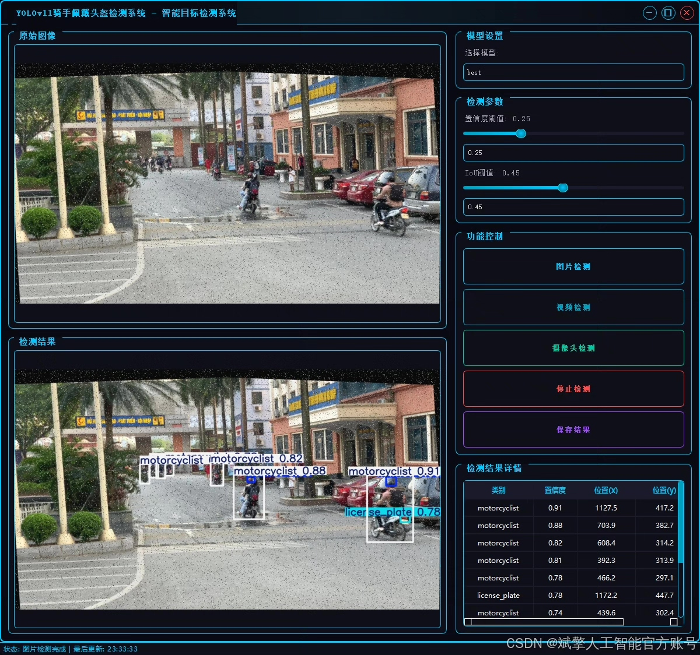
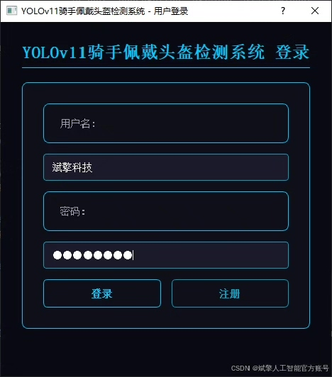
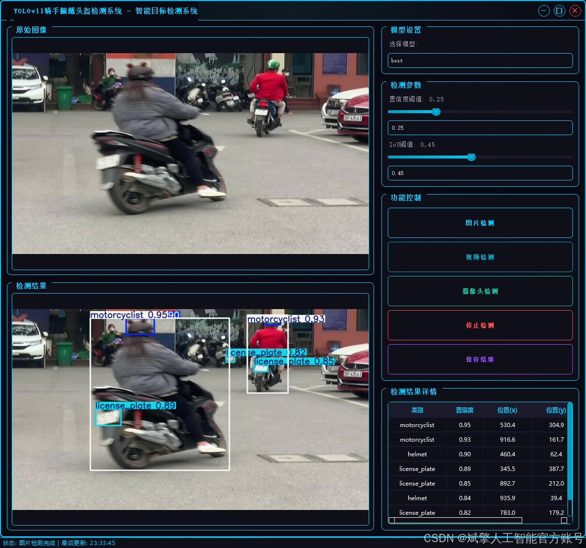
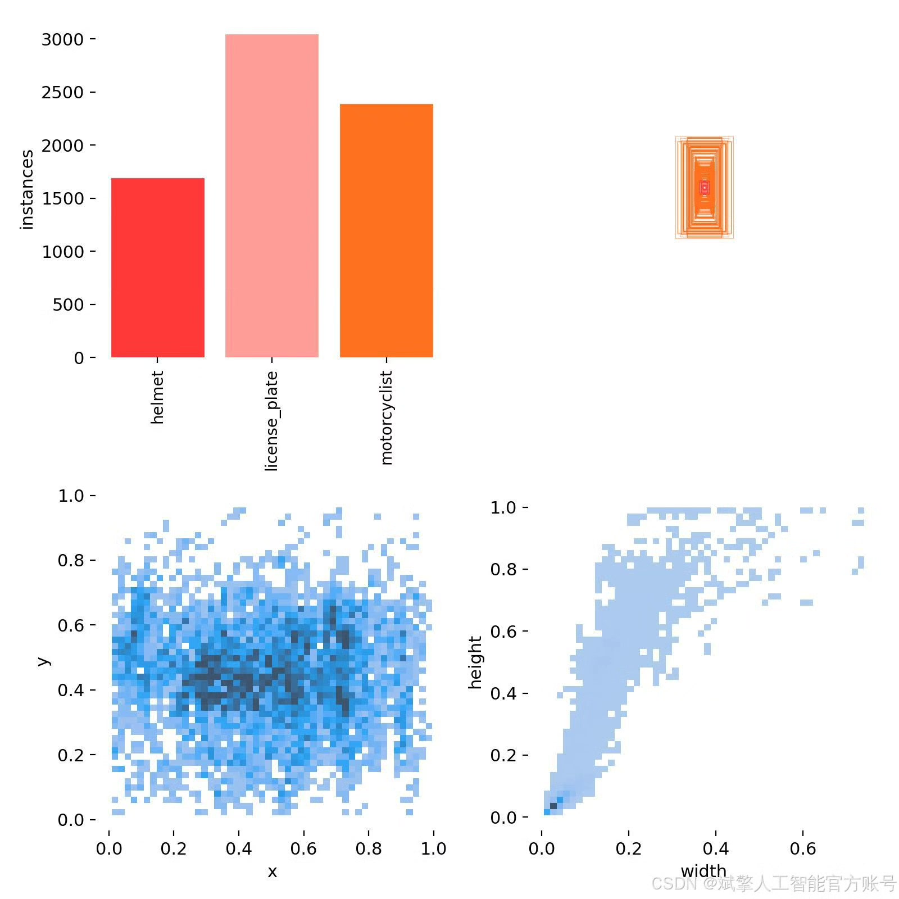
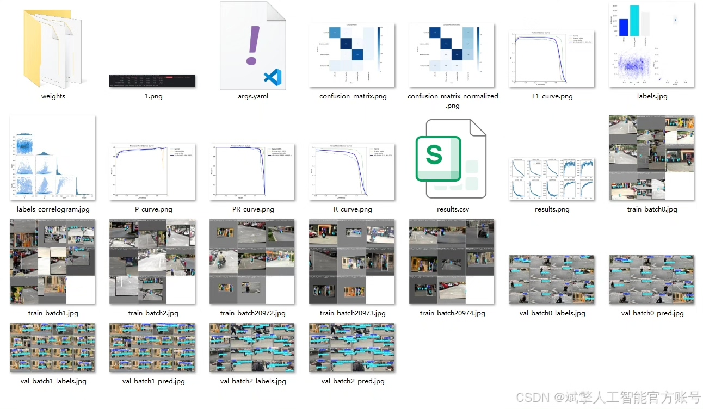
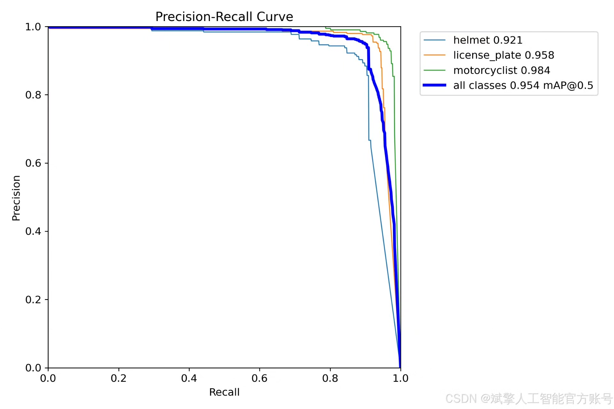
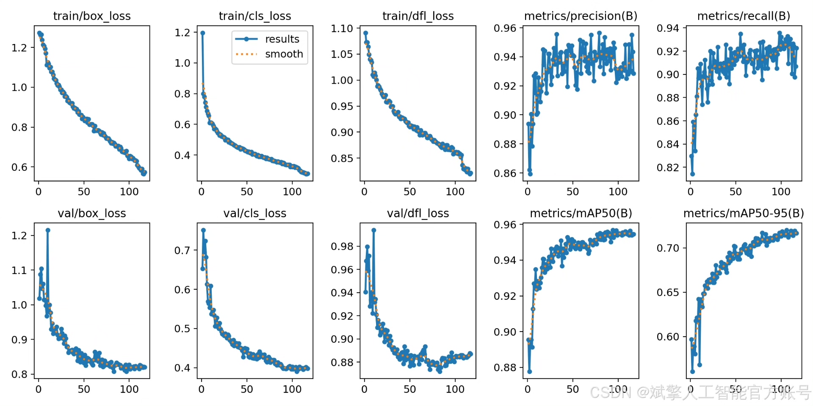
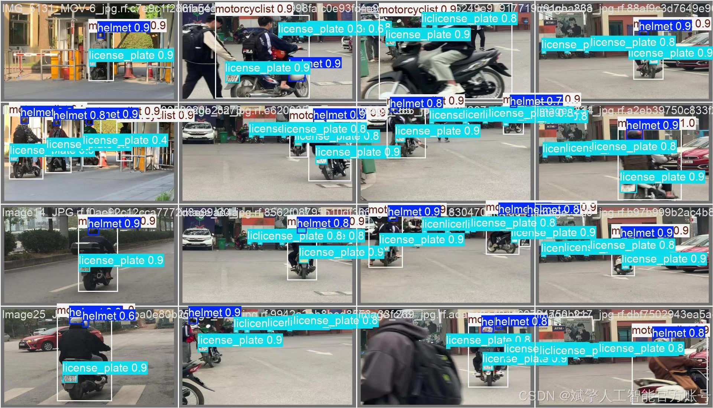

# YOLOv11 rider helmet detection system

## Body

This article introduces a rider helmet detection system based on the YOLOv11 object detection algorithm. The system aims to monitor and identify motorcycle riders in road traffic scenarios, with core functions including accurate detection and differentiation of three types of targets: riders wearing helmets (helmet), riders without helmets (motorcyclist), and motorcycle license plates (license_plate). This system holds significant practical application value for improving traffic law enforcement efficiency, promoting safe riding practices among riders, and reducing traffic accident casualties. Through training and validation on a carefully constructed dataset, the model achieves high detection accuracy and robustness, effectively addressing detection challenges in complex road environments.

Dataset:
nc: 3
names: ['helmet', 'license_plate', 'motorcyclist'],
dataset quantity: 1563 training images, 140 validation images, 100 test images

✅ User login registration: Supports password detection and security verification.
✅ Three detection modes: Based on the YOLOv11 model, supports image, video, and real-time camera detection, accurately identifying targets.
✅ Dual-screen comparison: Displays original images and detection results side by side.
✅ Data visualization: Real-time table displaying the category, confidence, and coordinates of detected targets.
✅ Intelligent parameter adjustment: Offers a confidence slide bar for dynamic optimization of detection accuracy, adapting to different scene requirements.
✅ Sci-fi interface: Dark theme paired with dynamic light effects, reducing visual fatigue and enhancing operational experience.

## Images

## Payment

Here is a pay link on Stripe ( https://buy.stripe.com/3cs8yP7sY87d0vu9AB ). Please contact me lonlonago@foxmail.com after funding $89, and I will send you a complete data files , thank you!

